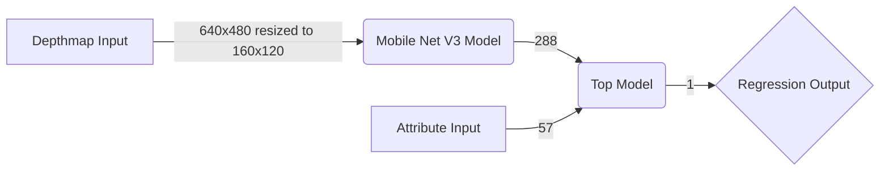

# File Structure
 - main.ipynb: the code used to train and test the model
 - generate_big_ds.py: to generate a large dataset of duplicates for testing purposes
 - requirements: python dependencies required to run the code
 - data: all the data provided and generated will be in this directory
 - models: the trained models will be saved in this directory

# Algorithm used
I have used a Deep Learning approach to solve this problem.

I have used a <b>Mobile Net V3 (small)</b> model to extract features from the given depthmap. The output layer of this model contains a max-pool layer which gives us <b><i>288</i></b> features. The dataset comes with <b><i>57</i></b> unique attributes about the image which can be used as features too. These are also extracted, normalised to the range <b><i>[0, 1]</i></b> and flattened to be used as features.

These <b><i>(288 + 57 = 345)</i></b> features are then fed into a simple neural network with <b><i>3</i></b> Dense layers:
1. Hidden Layer: <b><i>128</i></b> Nodes with Relu activation
2. Hidden Layer: <b><i>32</i></b> Nodes with Relu activation
3. Output Later: <b><i>1</i></b> Node with Linear activation

## Model Flowchart

## Training
For training I've used the <b>ADAM optimiser</b> along with a dynamic learning rate which reduces exponentially every epoch. Training loss used here is the <b>Mean Squared error</b>. I've also added gradient clipping to prevent exploding gradients.

<b> Note: The hyper parameters have not been fine tuned for optimal performance because of the small dataset.</b>
